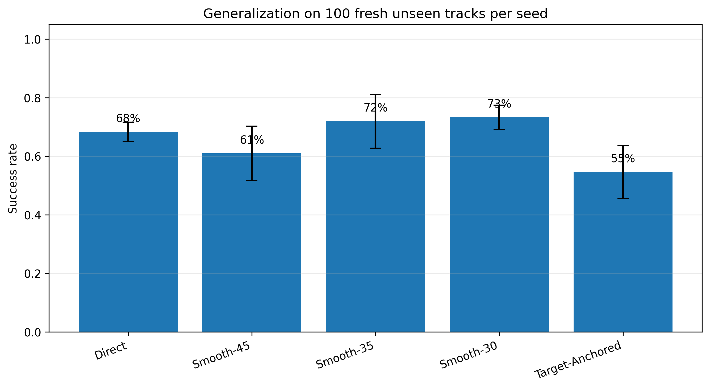
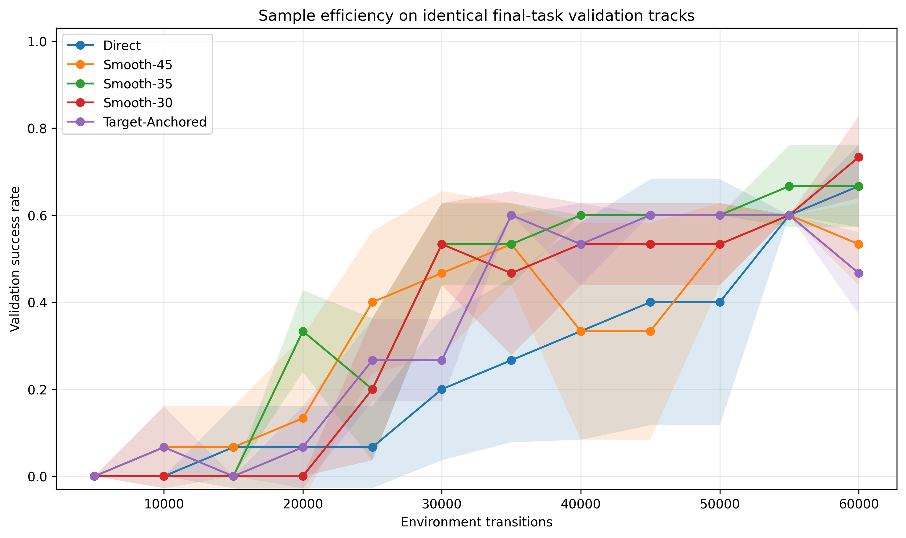
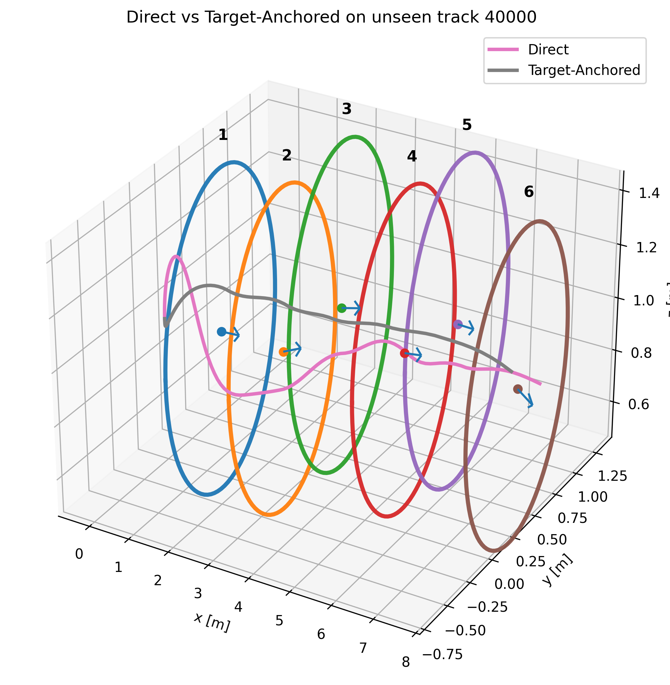
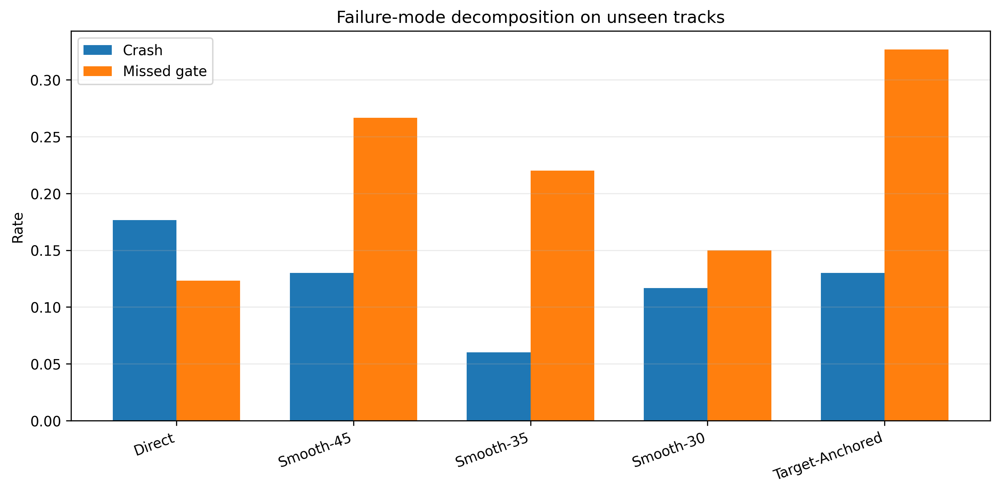
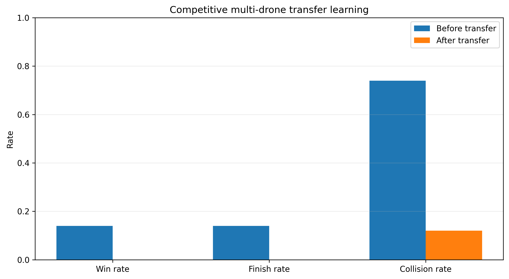

# Autonomous Drone Gate Racing with Soft Actor-Critic


A reinforcement-learning framework for **autonomous 3D drone gate racing** using a custom implementation of Soft Actor-Critic (SAC), procedural racing tracks and curriculum learning.

The project studies not only whether an RL policy can learn to fly through gates, but also **how the training curriculum changes generalization, crash rate and sample efficiency**.

---

## Main Results

Evaluation was performed across multiple training seeds on unseen procedural tracks.

| Training Strategy | Gates | Success | Crash | Miss |
|---|---:|---:|---:|---:|
| Direct | 4.84 ± 0.01 | 68.3 ± 4.0% | 17.7 ± 3.2% | 12.3 ± 3.8% |
| Smooth-45 | 4.56 ± 0.37 | 61.0 ± 11.4% | 13.0 ± 5.0% | 26.7 ± 16.3% |
| Smooth-35 | **4.97 ± 0.34** | 72.0 ± 11.3% | **6.0 ± 5.6%** | 22.0 ± 7.2% |
| Smooth-30 | **4.94 ± 0.12** | **73.3 ± 5.0%** | 11.7 ± 1.5% | **15.0 ± 4.6%** |
| Target-Anchored | 4.49 ± 0.29 | 54.7 ± 11.2% | 13.0 ± 1.0% | 32.7 ± 10.8% |

The experiments show that **curriculum design matters**: a well-shaped curriculum can improve success rate and reduce crashes relative to direct training, while a poorly chosen curriculum can make performance worse.

<p align="center">
  
  
</p>

---

## Environment

Each episode generates a procedural 3D racing task containing **six gates**.

The agent must:

1. approach the current gate;
2. cross it in the correct direction;
3. avoid missing the gate;
4. avoid crashing;
5. continue toward the next gate.

This creates a continuous-control problem where successful behavior requires both short-term stabilization and longer-horizon spatial planning.

---

## Observation Space

The policy receives a compact **22-dimensional state representation**, expressed primarily in the drone body frame.

This includes information describing:

- relative gate geometry;
- drone velocity;
- orientation-related state;
- progress through the current racing segment.

Using a body-frame representation reduces dependence on the absolute world coordinate system and supports generalization to new procedural tracks.

---

## Action Space

The SAC policy outputs four continuous normalized actions:

$$ a = [\phi_d, \theta_d, \dot{\psi}_d, \Delta T ]$$

corresponding to:

- desired roll;
- desired pitch;
- desired yaw rate;
- thrust adjustment.

Each action lies in

$$[-1,1]^4$$

before being mapped to the simulated drone controller.

---

## Soft Actor-Critic

SAC is implemented directly in PyTorch rather than through a high-level RL training framework.

The implementation includes:

- Gaussian stochastic actor;
- twin Q-networks;
- target Q-networks;
- experience replay;
- entropy-regularized objective;
- soft target updates;
- off-policy mini-batch training.

The objective encourages both reward maximization and sufficient exploration:

$$J(\pi)=\mathbb{E}\left[Q(s,a)-\alpha\log\pi(a|s)\right]$$

making SAC well suited to the continuous drone-control problem.

---

## Curriculum Learning

Several training strategies are compared.

### Direct Training

The agent immediately trains on the final racing task.

### Smooth Curricula

Task difficulty is progressively increased according to different transition schedules.

The experiments compare multiple curriculum thresholds, including:

- Smooth-45
- Smooth-35
- Smooth-30

### Target-Anchored Curriculum

A separate curriculum keeps training more strongly centered around intermediate target conditions.

The final results show that curriculum learning is **not automatically beneficial**: the schedule itself is a major design choice.

---

## Generalization

Policies are evaluated on procedural tracks not seen during training.

<p align="center">
  
</p>

This evaluates whether the policy learned a reusable gate-navigation strategy rather than memorizing a fixed race layout.

---

## Failure Analysis

The evaluation distinguishes between multiple failure modes:

- successful completion;
- collision/crash;
- missed gate.

<p align="center">
  
</p>

Separating these outcomes is useful because a curriculum may increase overall progress while changing the type of failures produced by the policy.

---

## Multi-Drone Transfer

A final experiment transfers the learned navigation behavior to a multi-drone racing scenario.

| Metric | Before Transfer | After Transfer |
|---|---:|---:|
| Win rate | 20% | **32%** |
| Finish rate | 20% | **32%** |
| Collision rate | 80% | **50%** |
| Mean gates | 1.30 | **2.38** |
| Mean progress | 1.46 | **2.56** |

<p align="center">
  
</p>

The transferred policy therefore shows better progress and substantially fewer collisions in the competitive setting.

---

## Training Configuration

The main experiments use:

```text
Training seeds          3
Steps / method / seed   60,000
Initial random steps    2,500
Batch size              256
Hidden size             128
Learning rate           3e-4
Discount γ              0.99
Target update τ         0.005
Entropy coefficient α   0.10
```

---

## Running the Project

Install the dependencies:

```bash
pip install -r requirements.txt
```

Open:

```text
drone_gate_racing_sac.ipynb
```

and run the experiment sections for:

- environment generation;
- SAC training;
- direct-learning baseline;
- curriculum variants;
- unseen-track evaluation;
- multi-drone transfer.

---

## Repository Structure

```text
.
├── drone_gate_racing_sac.ipynb
├── requirements.txt
├── assets/
├── results/
├── videos/
└── README.md
```

---

## What This Project Demonstrates

- Reinforcement Learning
- Soft Actor-Critic
- Continuous Control
- Autonomous Drones
- Curriculum Learning
- Procedural Environment Generation
- Policy Generalization
- Multi-Agent Transfer
- Experimental RL Evaluation
- Failure-Mode Analysis
- PyTorch

---

## Key Takeaway

The main result of the project is not simply that SAC can learn to fly through gates.

The experiments show that **the learning curriculum changes the final behavior of the policy**: appropriately staged difficulty can improve unseen-track success and reduce dangerous failure modes, while other curricula can degrade performance.

The multi-drone experiment further tests whether navigation knowledge learned in a single-agent setting transfers to a more complex competitive environment.
