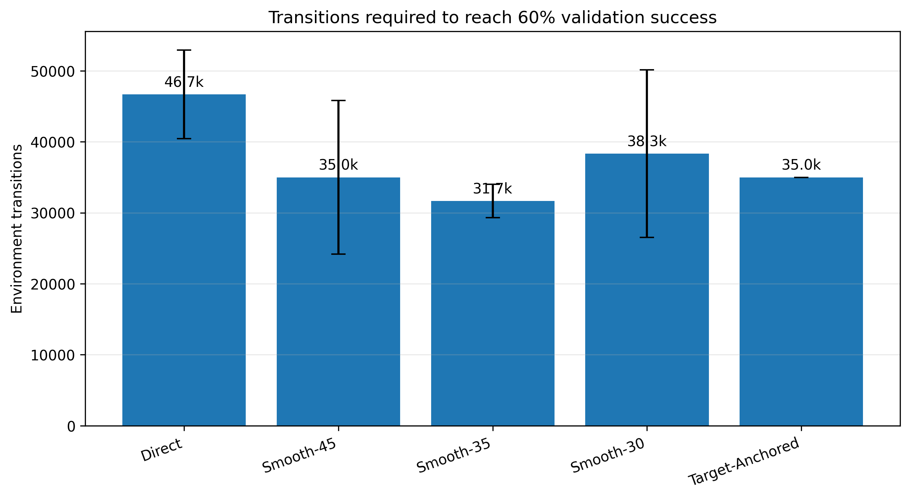
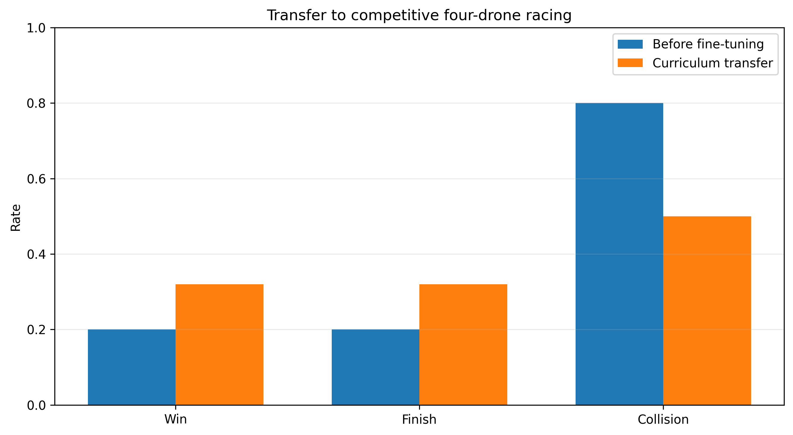

# Curriculum Scheduling for Sample-Efficient 3D Drone Gate Racing with SAC

A reinforcement learning project for **autonomous 3D drone gate racing** using a custom **Soft Actor-Critic (SAC)** implementation in PyTorch.

The project studies how **curriculum scheduling** affects sample efficiency, robustness, and generalization on procedurally generated 3D racing tracks. Five single-drone training strategies are compared under a shared evaluation protocol, followed by a **multi-drone transfer** experiment.

## Key Results

Across **3 training seeds** and **100 unseen test tracks per seed**:

- **Smooth-30 achieved the highest mean success rate: 73.3%**, compared with 68.3% for Direct SAC.
- **Smooth-35 achieved the lowest crash rate: 6.0%**, compared with 17.7% for Direct SAC.
- Smooth-35 also achieved the highest mean gates completed: **4.97/6**.
- In the multi-drone transfer experiment, the improved racer increased win/finish rate from **20.0% to 32.0%** and reduced collision rate from **80.0% to 50.0%**.


## Experiment

The main single-drone study compares:

1. **Direct** — trains on the final task from the beginning.
2. **Smooth-45**
3. **Smooth-35**
4. **Smooth-30**
5. **Target-Anchored**

All methods use the same underlying SAC implementation and are evaluated on unseen procedural tracks.

The central question is:

> Can a carefully scheduled curriculum make SAC learn a difficult 3D racing task more efficiently without sacrificing final-task generalization?

## Environment

The environment models a drone racing through **six procedurally generated 3D gates**.

The drone state contains:

- 3D position and velocity;
- roll, pitch, and yaw;
- angular rates.

The policy receives a **22-dimensional observation** built largely in the body frame, including:

- body-frame velocity;
- gravity direction;
- angular rates;
- relative geometry of the current gate;
- relative geometry of the next gate;
- track progress.

The continuous action is:

```text
[desired_roll, desired_pitch, desired_yaw_rate, thrust_delta]
```

normalized to `[-1, 1]^4`.

## Soft Actor-Critic

SAC is implemented directly in **PyTorch**, including:

- stochastic Gaussian actor;
- twin Q critics;
- target Q networks;
- replay buffer;
- soft target updates;
- entropy-regularized continuous control.

### Main Training Configuration

| Parameter | Value |
|---|---:|
| Training seeds | 3 |
| Steps / method / seed | 60,000 |
| Random exploration | 2,500 steps |
| Batch size | 256 |
| Hidden size | 128 |
| Learning rate | 3e-4 |
| Discount γ | 0.99 |
| Target update τ | 0.005 |
| Entropy coefficient α | 0.10 |
| Validation interval | 5,000 steps |

## Curriculum Learning

The curriculum variants retain the same six-gate objective while progressively changing task difficulty.

Difficulty is controlled through factors such as:

- gate precision;
- track geometry;
- heading variation;
- vertical variation;
- probability/severity of sharp turns.

The goal is to expose the agent to useful intermediate tasks while still evaluating every method on the same final objective.




## Unseen-Track Evaluation

Each trained seed is evaluated on **100 unseen procedural test tracks**.

The table below reports **mean ± standard deviation across the three training seeds**.

| Method | Mean Gates / 6 | Success Rate | Crash Rate | Miss Rate |
|---|---:|---:|---:|---:|
| Direct | 4.84 ± 0.01 | 68.3 ± 4.0% | 17.7 ± 3.2% | 12.3 ± 3.8% |
| Smooth-45 | 4.56 ± 0.37 | 61.0 ± 11.4% | 13.0 ± 5.0% | 26.7 ± 16.3% |
| **Smooth-35** | **4.97 ± 0.34** | 72.0 ± 11.3% | **6.0 ± 5.6%** | 22.0 ± 7.2% |
| **Smooth-30** | 4.94 ± 0.12 | **73.3 ± 5.0%** | 11.7 ± 1.5% | 15.0 ± 4.6% |
| Target-Anchored | 4.49 ± 0.29 | 54.7 ± 11.2% | 13.0 ± 1.0% | 32.7 ± 10.8% |

The results suggest that **curriculum timing matters**: no single schedule dominates every metric.

- Smooth-30 provides the strongest average success rate.
- Smooth-35 produces the lowest crash rate and the highest average number of gates completed.
- Smooth-45 is less consistent across seeds.
- Target-Anchored underperforms the best smooth schedules on final-task success.


## Multi-Drone Transfer Bonus

A second experiment tests whether a transferred curriculum-trained racing policy can be adapted to a **four-drone competitive setting**.

| Metric | Before Transfer Improvement | After Transfer Improvement |
|---|---:|---:|
| Win rate | 20.0% | **32.0%** |
| Finish rate | 20.0% | **32.0%** |
| Collision rate | 80.0% | **50.0%** |
| Mean gates | 1.30 | **2.38** |
| Mean progress | 1.46 | **2.56** |
| Mean finish time | 3.83 s | **2.86 s** |

The improved transfer policy raises win/finish rate by **12 percentage points**, lowers collision rate by **30 percentage points**, and increases mean gates completed from **1.30 to 2.38**.




A representative four-drone rollout is available at:

```text
videos/four_drone_transfer.mp4
```

## Reward Design

The reward combines:

- progress toward the current gate;
- radial alignment;
- successful gate crossing;
- gate-centering precision;
- final completion bonus;
- crash and missed-gate penalties;
- small time, attitude, angular-rate, action, and speed costs.

A gate is counted only when the drone crosses the actual **3D gate plane** within the valid radius.

## Repository Structure

```text
drone-gate-racing-sac/
├── README.md
├── drone_gate_racing_sac.ipynb
├── requirements.txt
├── .gitignore
├── assets/
│   ├── sample_efficiency.png
│   ├── steps_to_60_percent.png
│   ├── unseen_success.png
│   ├── failure_modes.png
│   ├── direct_vs_curriculum_trajectory.png
│   ├── multi_drone_transfer.png
│   └── curriculum_multi_drone_transfer.png
├── results/
│   ├── MASTER_RESULTS.json
│   ├── final_summary.csv
│   ├── unseen_100_track_results.json
│   └── training_logs.json
└── videos/
    ├── single_drone_unseen_rollout.mp4
    └── four_drone_transfer.mp4
```

## Quick Start

```bash
git clone https://github.com/samuelecivale/drone-gate-racing-sac.git
cd drone-gate-racing-sac

python -m venv .venv
source .venv/bin/activate
pip install -r requirements.txt

jupyter notebook
```

Open:

```text
drone_gate_racing_sac.ipynb
```

## Reproducibility

The experiment uses:

- fixed Python, NumPy, and PyTorch seeds;
- three independent training seeds;
- separate procedural track sets for training, validation, and testing;
- validation-based model selection;
- saved JSON/CSV experiment summaries.

The public result files are kept in `results/`; large PyTorch checkpoints are intentionally excluded from Git.

## Suggested GitHub Topics

```text
reinforcement-learning
deep-reinforcement-learning
soft-actor-critic
curriculum-learning
robotics
drone
autonomous-systems
continuous-control
pytorch
multi-agent-reinforcement-learning
simulation
```

## Author

**Samuele Civale**  
MSc Artificial Intelligence and Robotics — Sapienza University of Rome

GitHub: [@samuelecivale](https://github.com/samuelecivale)

## Disclaimer

The environment uses simplified simulated flight dynamics and is intended for reinforcement-learning research and experimentation. It is not a high-fidelity flight model or a controller intended for direct deployment on a physical drone.
